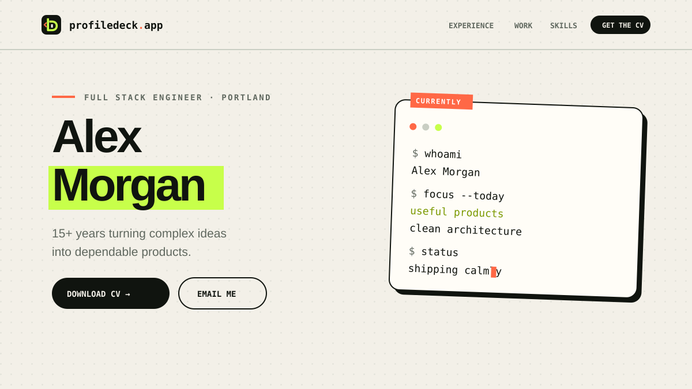

# ProfileDeck

ProfileDeck is a self-hosted portfolio and CV content management system built
with Laravel, Filament, Tailwind CSS, and Dompdf. Enter your career information
once, manage it from a friendly admin panel, and publish both a responsive
profile and a generated PDF CV from the same database.



## Features

- Responsive public profile with work history, projects, skills, education,
  certifications, training, interests, and an optional external blog
- Filament admin resources for every content type
- HTML CV preview and downloadable A4 PDF
- Dynamic `:years` placeholder calculated from the oldest visible role
- Featured and visibility controls for projects and other records
- Project image uploads with graceful monogram fallbacks
- Company rebrand support through a former-name field
- JavaScript-assisted email link that keeps the plain address out of homepage
  markup
- Fictional demo data suitable for development and screenshots

## Requirements

- PHP 8.3 or newer
- Composer
- Node.js 20 or newer with npm
- SQLite for the quickest setup, or MySQL 8+ for a production-like environment

## Quick start with SQLite

```bash
git clone https://github.com/your-account/profiledeck.git
cd profiledeck

composer install
cp .env.example .env
php artisan key:generate
touch database/database.sqlite
php artisan migrate --seed
php artisan storage:link

npm install
npm run build
php artisan serve
```

Open `http://127.0.0.1:8000` for the profile and
`http://127.0.0.1:8000/admin` for the admin panel.

Demo administrator:

- Email: `admin@example.com`
- Password: `password`

These credentials are public. Replace the demo user or change its password
before exposing any installation to the internet.

## MySQL setup

Create a database, then change the database section in `.env`:

```dotenv
DB_CONNECTION=mysql
DB_HOST=127.0.0.1
DB_PORT=3306
DB_DATABASE=profiledeck
DB_USERNAME=profiledeck
DB_PASSWORD=choose-a-strong-password
```

Run `php artisan migrate --seed` after saving the file.

## Add your own content

The default `DatabaseSeeder` calls `DemoSeeder`, which exists only to provide a
complete first-run experience. For a clean production site you can:

1. Run the demo, sign in, replace its records through Filament, and delete
   records you do not need; or
2. Copy `database/seeders/PersonalSeeder.php.example` and
   `PersonalProjectSeeder.php.example` to their `.php` counterparts, populate
   them, then run:

```bash
php artisan migrate:fresh
php artisan db:seed --class=PersonalSeeder
```

The real personal seeder filenames and `database/seed-data/personal/` are
gitignored. This lets maintainers keep a reproducible private site setup
without publishing personal history or media.

Profile fields such as the tagline, summary, and bio support `:years`. It is
replaced at render time with the number of full years since the oldest visible
experience.

## Images and storage

Project uploads use Laravel's public disk. Run `php artisan storage:link` once
per deployment. A project without a thumbnail receives an automatically
generated initials tile.

For a PDF portrait, set `cv_photo_path` to a file that exists under `public/`.
The browser profile image uses `photo_path` in the same way.

## Routes

| Route | Purpose |
| --- | --- |
| `/` | Public profile |
| `/cv` | Printable HTML CV preview |
| `/cv.pdf` | Generated PDF download |
| `/admin` | Filament administration |

## Testing and formatting

```bash
vendor/bin/pint --test
php artisan test
npm run build
```

Tests use an in-memory SQLite database and load only fictional demo data.

## Deployment checklist

- Set `APP_ENV=production`, `APP_DEBUG=false`, and the canonical `APP_URL`.
- Replace the demo administrator and remove content you do not own.
- Configure production database, queue, cache, session, mail, and HTTPS.
- Run `php artisan migrate --force`, `php artisan storage:link`, and
  `npm ci && npm run build`.
- Cache configuration/routes/views as appropriate for your hosting platform.
- Back up the database and `storage/app/public` uploads.

## Contributing

See [CONTRIBUTING.md](CONTRIBUTING.md). Security guidance is in
[SECURITY.md](SECURITY.md).

## License

ProfileDeck is open-source software licensed under the
[MIT License](LICENSE).
